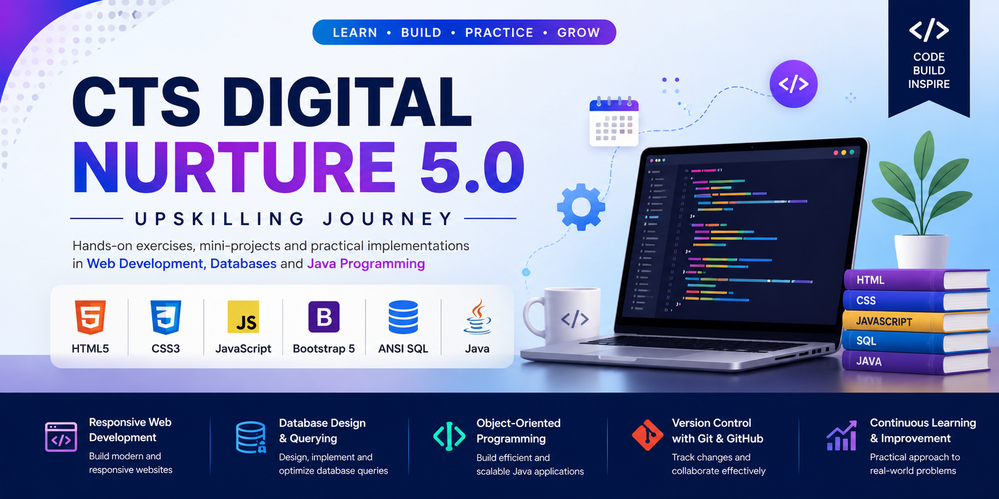

# 🚀 CTS Digital Nurture 5.0 – Upskilling Journey

  

  Hands-on Exercises • Mini Projects • Practical Learning

---

##  About

This repository contains hands-on exercises, mini-projects, and assignments completed as part of the **Cognizant Digital Nurture 5.0 Upskilling Program**. The work focuses on building practical skills in web development, database management, and Java programming.

---

## Technologies Covered

* HTML5
* CSS3
* JavaScript
* Bootstrap 5
* ANSI SQL
* Java

---

##  Modules

### Module 1 – Frontend Development

* HTML5
* CSS3
* JavaScript
* Bootstrap 5

**Project:** Community Event Portal

### Module 2 – ANSI SQL

* Database Design
* DDL & DML Commands
* Joins, Views & Subqueries
* Query Optimization

### Module 3 – Java Programming

* Core Java
* OOP Concepts
* Collections Framework
* Exception Handling
* JDBC

---

## Highlights

✔ Responsive Web Development

✔ Interactive Community Event Portal

✔ Database Query Implementation

✔ Object-Oriented Java Programming

✔ Version Control with Git & GitHub

---

## >Learning Outcomes

* Developed responsive web applications using HTML, CSS, JavaScript, and Bootstrap
* Designed and optimized database queries using ANSI SQL
* Applied object-oriented programming concepts using Java
* Built practical solutions through hands-on exercises and mini-projects
* Strengthened problem-solving and software development skills

---

## Author

**Aashika**
B.E. Artificial Intelligence and Machine Learning
K. Ramakrishnan College of Engineering

---

